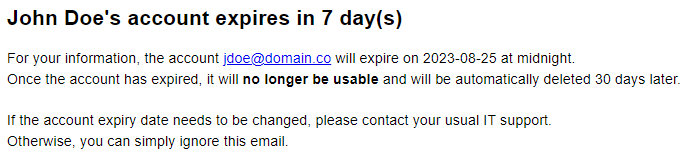

# ExpiringAccountByEmail

This script can be used to inform users and their manager that their Active Directory account is expiring. 

The best use of this PowerShell code is to place it in a scheduled task, executed everyday.

The script accepts several parameters:

- `ExpiresInDays`: Used to indicate when the email should be sent according to the account expiration date. By default, email will be sent 30, 15 and 7 days before the expiration.
- `Recipients`: The possible values are "Self" and/or "Manager"
- `TestRecipient`: This parameter can be used when you test the script to make sure that everything is OK. When this parameter is employed, all emails will be sent to theses addresses.
- `SearchBase`: Allow to scope the script to a specific organizational unit. The default value is the root of the domain.

Preview of an email:

